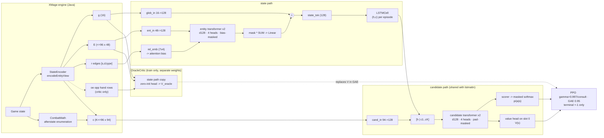

# The current agent, as a paper would draw it

*Written 2026-09-10 from the source on `main` (commit dfece8b). Every module
shape and parameter count below was measured by instantiating `build_net`
in `rl/policy_server.py`, not copied from an older doc. The figure and the
gap list in §6 are the deliverable; §6 is analysis, not results.*

**Current arm:** encoder **v6** (`-Drl.encoderV=6`) + `--arch entattn`
(`EntityAttnPolicy`, LSTM on), `--cdim 94 --gdim 16 --edim 48 --emax 96
--max-k 96`. Every recent experiment (`b1_timing_ab.sh`, `cand_census.sh`,
`run_dimir_2k.sh`, `deck_value_check.sh`, the oracle A/B) serves this arm.
`rung0_lane.sh` still *defaults* to `R0_ENCODER_V=2` (flat v2 + `lstmattn`)
unless told otherwise — see gap 10.

---

## 1. Observation

The engine (`RLPlayer` → `StateEncoder.encodeEntityView`) emits, per consult,
four things plus one optional privileged channel:

```
{"t":"consult", "g":[16], "e":[[48],...<=96], "r":[[src,dst,type],...],
                "c":[[94],...<=96], "oe":[[48],...]  (critic only) }
```

### 1a. Globals `g` — 16 floats (`encodeGlobals`)

| idx | meaning |
|---|---|
| 0 | turn ÷ 30 |
| 1 | I am the active player |
| 2–7 | step one-hot: main · declare-attackers · declare-blockers · other combat · end · other |
| 8, 9 | my life ÷ 20 · opp life ÷ 20 |
| 10 | my library ÷ 60 |
| 11, 12 | my graveyard ÷ 30 · opp graveyard ÷ 30 |
| 13 | stack depth ÷ 3 |
| 14 | **opponent hand size ÷ 10** (a count; mine are tokens) |
| 15 | "consult budget remaining, set by RLPlayer" — **never written; always 0** |

### 1b. Entity rows `E` — up to 96 tokens × 48 floats

One token per: the two players, every permanent, every stack object, every
card in my hand, every card in both graveyards. Sorted by priority band
(players · my creatures · their creatures · stack · other permanents · my
hand · graveyards) then power/toughness/MV/createOrder; truncation drops from
the bottom and `entityTrunc` counts it. The pool is a SUM, so order is not
observable (`entattn_check.py` PERMUTE = 1.4e-6).

| idx | group | features |
|---|---|---|
| 0–7 | slot & zone | occupied · mine · theirs · zone one-hot (battlefield / hand / stack / graveyard / player) |
| 8–15 | body | power ÷6 · toughness ÷6 · **damage marked ÷6** · toughness remaining ÷6 · creature · land · other permanent · MV ÷6 |
| 16–23 | status | tapped · summoning-sick · attacking · blocking · can-attack · can-block · entered-this-turn · token |
| 24–37 | 14 combat keywords | flying … protection, **indexed from a 14-column subset** of `e2_features.tsv` (indestructible has no column, always 0) |
| 38–40 | stack only | depth ÷4 · is-instant · is-sorcery |
| 41–43 | target flags | targets-creature · targets-player · targets-spell (3 more table columns) |
| 44–47 | player token only | life ÷20 · hand ÷10 · lands ÷10 · untapped lands ÷10 |

**There is no card identity in an entity row.** No name hash, no full
feature vector — 17 of the table's 68 columns, and nothing else.

### 1c. Relations `r` — typed directed edge list

| type | edge | emitted from |
|---|---|---|
| 0 `blocks` | blocker → attacker | combat groups |
| 1 `blocked_by` | attacker → blocker (reverse, typed separately: the bias is directed) | combat groups |
| 2 `attacking_player` | attacker → defending player token | combat groups |
| 3 `targets` | stack object → its target | stack abilities |
| 4 `controls` | player token → permanent | battlefield |
| 5 `attached_to` | aura/equipment → host (empty at rungs 0–3) | battlefield |

Server-side the list becomes a dense `(E,E)` type-index matrix (0 = no edge)
so `rel_emb` receives gradient.

### 1d. Candidates `c` — K ≤ 96 rows × 94 floats (`CAND_DIM = 25 + 68 + 1`)

| idx | contents |
|---|---|
| 0–5 | decision-type one-hot: PASS · LAND · SPELL · TARGET · ATTACK · BLOCK |
| 6–24 | **type-specific scalars, slots overloaded per type:** cards → MV, P, T, creature, instant, sorcery (6–11); player targets → me/opp/life (12,13,15); permanent targets → creature, P, T, mine (12,14–16); **joint block assignment (v4)** → afterstate consequences: damage taken, attackers killed, value killed, blockers lost, value lost, defender dies, blockers used, life after (6–13); **joint attack subset (v5)** → damage dealt, their kills, my losses, lethal, attackers used, opp life after, bodies/power/toughness retained, crack-back, my life after (6–18); per-blocker context for single blocks (17–24) |
| 25–92 | the full **68-column card feature table** (`e2_features.tsv`: 9 answer classes, 20 effect APIs, 18 keywords, 6 trigger kinds, static/replacement/activated, 3 target flags, damage/pump magnitudes, 5 type flags, recursive, multi-face) |
| 93 | unknown-card flag |

The attack and block decisions are **afterstate candidates**: the policy
never sees which cards form the assignment, only what it does
(`CombatMath`). This is the change that bought +27 points of
block-optimality (`ATTACK-JOINT-RESULT.md`).

### 1e. Handshake and checkpoints

The hello carries `sdim/cdim/gdim/edim/emax/rtypes`; a mismatch is refused
with the reason. Checkpoints carry a `dims` record (`cdim/gdim/edim/rtypes/
r0`) and refuse to load into a server whose flags disagree. `EMAX` and
`MAX_K` are buffers (padded, masked, no weights); `GDIM/EDIM/CDIM/len(RTYPES)`
are meaning.

---

## 2. Network — `EntityAttnPolicy` (d = 128, 4 heads, FFN 256, dropout 0, post-LN, no positional encoding)

```
state path                                        params
  ent_in    Linear(48 -> 128)                       6,272
  rel_emb   Embedding(7, 4)  padding_idx=0             28   -> (B,4,E,E) additive attention bias
  ent_enc   TransformerEncoder x 2                 264,960   attn_mask = rel bias + (-inf on padded keys)
  pool      mask * y, SUM over E, Linear(128->128)  16,512
  glob_in   Linear(16 -> 128)                        2,176   (the inherited state_in)
            state_tok = glob_in(g) + pool(SUM_i ent_enc(ent_in(E))_i)        -- no LayerNorm
  cell      LSTMCell(128, 128)                     132,096   h reset every episode; h replaces state_tok

candidate path (shared verbatim with lstmattn via from_state_token)
  cand_in   Linear(94 -> 128)                       12,160
  enc       TransformerEncoder x 2 over [h | c_1..c_K]   264,960   key-padding mask on padded candidates
  scorer    MLP 128->64->1 on positions 1..K          8,321   masked_fill(-1e9) -> softmax over K
  value     MLP 128->64->1 on position 0              8,321

total 715,806     (lstmattn 430,082 · e0 47,554)
```

Equations, as the code computes them:

- bias`[b,h,s,d]` = `rel_emb[rel[b,s,d]][h]`, so an edge `[s,d,t]` biases
  the attention of **query s toward key d** by a per-(type, head) scalar;
  padding_idx keeps the "no edge" row exactly 0 (arm R0 is plain
  self-attention *numerically*).
- `state_tok = W_g g + W_p Σ_i m_i y_i` — SUM, not mean, because mean-pooling
  makes one 2/2 and three 2/2s identical (`ENCODER-V6-NETWORK.md` §0).
- `(h, c) = LSTMCell(state_tok, (h, c))`; `x = [h ‖ W_c c_1 … W_c c_K]`;
  `y = enc(x)`; `logit_k = scorer(y_k)`, `V = value(y_0)`.
- Policy = softmax over the legal candidate set; every decision type is the
  same head. Per-action log-prob, no hierarchical decoder.

---

## 3. Training — PPO, terminal reward only

| knob | value |
|---|---|
| reward | +1 / −1 / 0 at episode end, nothing else (`--shape` exists, measured null) |
| γ | 0.997 **per consult** (~45 consults/game) |
| GAE λ | 0.95, advantages normalised per batch |
| clip · epochs · entropy · value coef | 0.2 · 4 · 0.01 · 0.5 |
| optimiser | Adam 3e-4, grad-norm clip 0.5 |
| update cadence | every 32 completed episodes |
| recurrent update | true BPTT: 8 episodes stepped in lockstep, hidden detached every 64 steps, backward per window (memory-bounded) |
| flat update | minibatch 256 |
| sampling | Categorical over logits; optional `--desperation` temperature τ = 1 + d·max(0, −V) ≤ 2.5 |
| memory | one LSTMCell hidden per connection/session, reset at episode start |
| measured | `value_ev ≈ 0.34` for the trained policy head against the discounted Monte-Carlo outcome (`ORACLE-GUIDING.md` §6a) |

---

## 4. The asymmetric critic (`OracleCritic`, `--oracle`)

A **separate** network — its own `EntityAttnPolicy` trunk with only the
state path used (298,269 parameters) and a zero-initialised value head.
It sees the policy's entity rows plus the opponent's hand (`"oe"`), is
trained on Monte-Carlo targets for 2 epochs per update, replaces `values[t]`
before GAE, and is never consulted at inference. Isolation is gated
(`oracle_gate.py`, 3 levels). The online probe was underpowered by
construction (256 episode labels vs ~700k params); `oracle_ridge.py` is the
replacement instrument.

---

## 5. Figure 1 — data flow



---

## 6. Discussion — what the figure says is missing

Analysis, not results. Each item names the element and where in the source
it lives; none has been measured. Numbered to match the callouts on the
published figure.

1. **Candidates never attend to entities.** The whole board collapses to one
   128-d token before any candidate sees it (`state_token` → `from_state_token`).
   A "cast X" or "target Y" row cannot attend to the permanent it would hit
   or the board it would enter. This is the structural form of the §2a
   per-candidate collision in `HANDOFF-CREDIT.md`: candidate rows are
   context-free, and the only context is one pooled vector. The natural fix
   is cross-attention from candidate tokens to entity tokens (or an entity
   index carried in `T_TARGET` rows so the scorer can read the target's token).
2. **No shared card embedder.** `ENCODING-DESIGN.md` §4d listed this as the
   first ByteRL ingredient we lacked; v6 did not add it. Entity rows carry 17
   hand-picked table columns and no identity; candidate rows carry the full
   68 + flag. The same card in hand and as a cast candidate are two unrelated
   hand-rolled encodings, and the state path cannot tell two 2/2s with
   different text apart.
3. **The SUM pool is unnormalised.** `state_tok` magnitude grows with entity
   count (up to 96); a fresh critic on it diverged until its head was
   zero-initialised (`ORACLE-GUIDING.md` §7). There is no LayerNorm on
   `state_tok`, and `glob_in(g)` is added at a different scale. Sum ‖ count,
   or a LayerNorm after the pool, keeps the collision fix and drops the scale.
4. **Relations are 28 scalars.** `rel_emb` is a per-(type, head) additive
   bias, T5-style — no edge features, no relation in the candidate encoder,
   no "same combat group" or "could block" edge. Adequate for the six
   pointers emitted; it cannot express anything graded.
5. **Dead input.** `g[15]` is documented as "consult budget remaining, set by
   RLPlayer" and is never written (`grep` finds no writer). Constant zero;
   harmless, but it is a slot that claims to carry something.
6. **Hidden information is a count.** The opponent's hand is `g[14]`; the
   library — a fixed, known decklist at every rung — is not encoded at all;
   the only memory is one LSTMCell truncated at 64 steps and reset per episode.
   The critic-side oracle exists; the policy side has nothing.
7. **The value head reads the post-candidate-encoder state slot**, so V(s)
   depends on the candidate set offered, and it shares every parameter with
   the policy. That is by design (the oracle critic is separate for exactly
   this reason), but it means the measured `value_ev ≈ 0.34` is a property of
   the shared trunk, and any critic improvement leaks into the policy trunk.
8. **No colour or mana type anywhere** — mana value only, lands as counts.
   Free at mono-colour rungs 0–3; a hard wall at the first two-colour deck.
9. **Candidate slots are overloaded per decision type** (idx 6–24 mean
   different things under each `T_*`), so the scorer must route on the
   one-hot before reading them. Timing and target-availability features are
   absent from candidate rows (`HANDOFF-CREDIT.md` §0, direction D).
10. **The lane default has drifted.** `rung0_lane.sh` defaults to
    `R0_ENCODER_V=2` (flat v2, `lstmattn`, sdim 32) while every recent
    experiment serves v6/`entattn`. A lane started without the env var
    trains the previous architecture.

Of these, 1–3 are the ones a reviewer would circle on the figure; 5 and 10
are hygiene; 6–9 are rung-dependent and documented as such elsewhere.

---

## 7. Provenance

| what | where |
|---|---|
| network classes, `build_net` | `rl/policy_server.py:82-358` |
| `Trainer` init / dims / act / update / BPTT | `rl/policy_server.py:375-499, 584-666, 721-960` |
| flat v1–v5 state, candidate builders | `rl/xmage-src/StateEncoder.java:60-431` |
| v6 globals / entities / relations / oracle | `rl/xmage-src/StateEncoder.java:449-942` |
| 68-column table definition | `rl/e2_extract.py:27-50` |
| lane flags | `rl/rung0_lane.sh:55-134` |
| parameter counts | `build_net(arch, 32, 94)` and `OracleCritic().used_parameters()`, torch CPU, 2026-09-10 |
